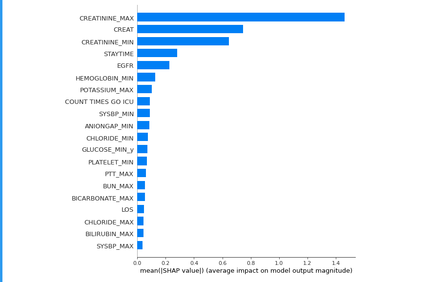
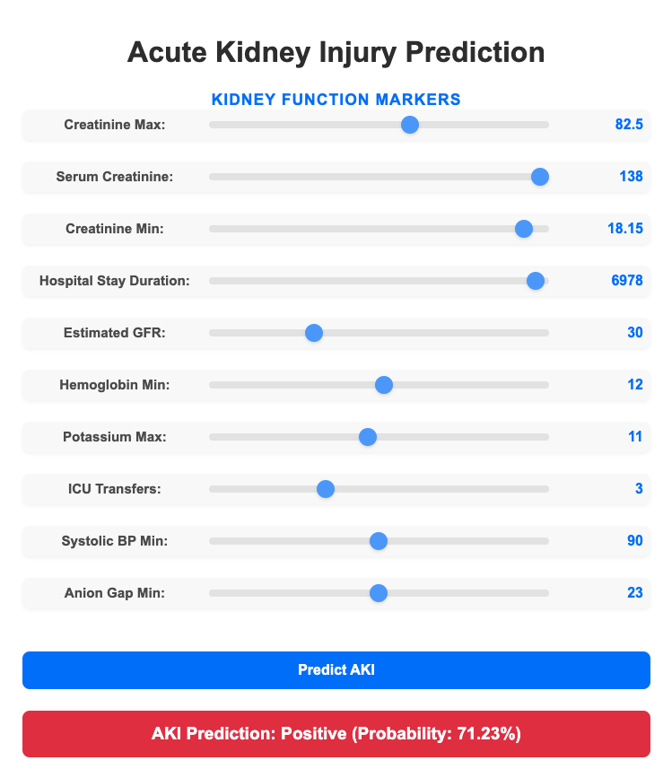

# Acute Kidney Injury Prediction Using ICU Data from MIMIC-III

This project focuses on predicting Acute Kidney Injury (AKI) during the first 7 days of a patient's ICU stay using machine learning. The model is developed using a Gradient Boosting Classifier and deployed via a user-friendly interface. Below is an overview of the project, including details about the dataset, model development, and deployment.

- **Application**: [Live Demo](https://acute-kidney-injury-prediction-app.onrender.com/)
---

## Dataset

The dataset used in this project is the **"kidigo_7_days_creatinine"** dataset, which is derived from a query that checks if a patient had AKI during the first 7 days of their ICU stay. The diagnosis is based on the KDIGO guidelines and relies solely on the creatinine feature.

- **Download Instructions**: The dataset can be downloaded by following the instructions provided in the [Aki-Predictor repository](https://github.com/ExaScience/Aki-Predictor).

---

## Model

The model is developed using the **Gradient Boosting Classifier** from the `scikit-learn` library. The development process is documented in a Jupyter Notebook file named `Model_Development.ipynb`.

- **Training and Testing**: The dataset is split into 70% training and 30% testing sets.
- **Performance Metrics**:
  - **Test Accuracy**: 0.823
  - **AUC-ROC**: 0.907
  - **AUC-PR**: 0.855

For more details on the Gradient Boosting Classifier, refer to the [scikit-learn documentation](https://scikit-learn.org/stable/modules/generated/sklearn.ensemble.GradientBoostingClassifier.html).

---

## User Interface (UI)

To make the model interpretable and user-friendly, we used **SHAP (SHapley Additive exPlanations)** to identify the top 10 most important features. 

- **SHAP Documentation**: [SHAP Documentation](https://shap.readthedocs.io/en/latest/)

These features are used as inputs in the UI, while the remaining features are imputed (mean imputation for numerical features and mode imputation for categorical features).

---

## Deployment

The model is dockerized and deployed on **Render**, a cloud application platform that simplifies building and deploying applications.

---

## How to Use

1. **Clone the Repository**: Start by cloning the repository to your local machine.
2. **Download the Dataset**: Follow the instructions in the [Aki-Predictor repository](https://github.com/ExaScience/Aki-Predictor) to download the dataset.
3. **Run the Model**: Open the `Model_Development.ipynb` notebook to explore the model development process.
4. **Deploy the Model**: Use the provided Dockerfile to deploy the model.

---

## Acknowledgments

- The dataset is sourced from the [Aki-Predictor repository](https://github.com/ExaScience/Aki-Predictor).
- The model is built using `scikit-learn` and explained using SHAP.

---

For any questions or issues, please feel free to open an issue in the repository.
